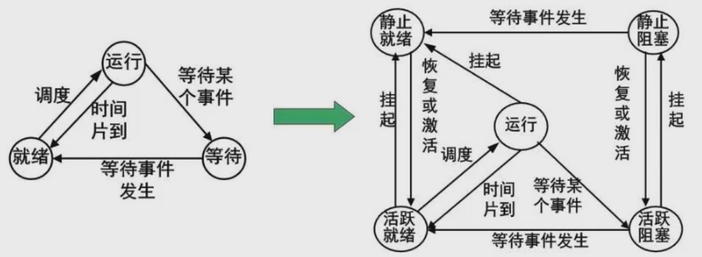
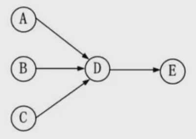
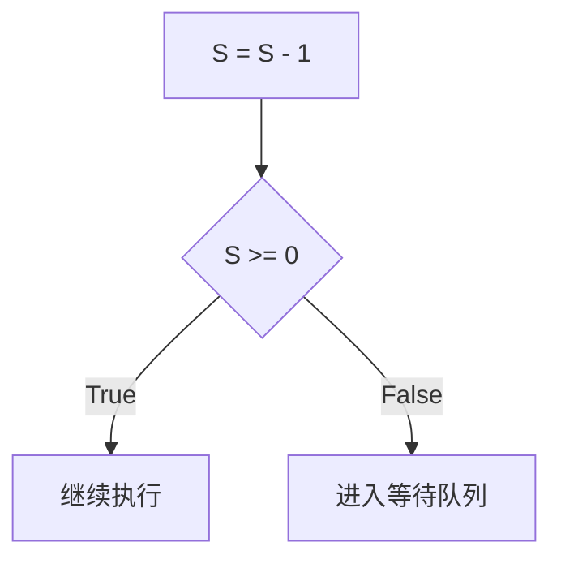
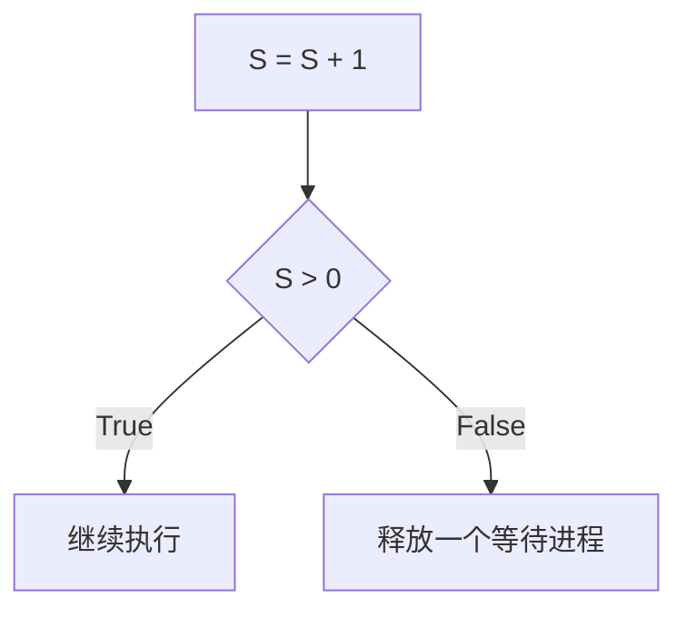

## 操作系统

作用

- 管理系统的硬件, 软件, 数据资源
- 控制程序的运行
- 人机之间的接口
- 应用软件与硬件之间的接口

功能

- 进程管理
  - 进程状态
  - 前趋图
  - PV操作
  - 死锁问题
- 存储管理
  - 段页式存储
  - 页面置换算法
- 文件管理
  - 索引文件
  - 位示图
- 作业管理
- 设备管理
- 微内核操作系统
  - 虚设备与SPOOLING技术

### 进程管理

#### 进程状态转换

- 运行(running): 所有资源都已经配足, 包括 `CPU` 资源
- 就绪(ready): 除 ` CPU` 外的其他资源都已配足
- 等待(blocking): 除 `CPU` 外还缺其他资源

`运行` → 需要等待某个事件 → `等待`
`等待` → 等待的事件发生 → `就绪`
`就绪` → 被调度 → `运行`
`运行` → 时间片结束 → `就绪`

缺点: **无法人为管控进程状态**, 优先执行或者主动挂起

增加两种状态 `静止就绪` `静止等待`

`就绪` → 挂起 → `静止就绪`
`运行` → 挂起 → `静止就绪`
`静止就绪` → 恢复或激活 → `就绪`
`阻塞` → 挂起 → `静止等待`
`静止等待` → 恢复或激活 → `阻塞`
`静止等待` → 等待的事件发生 → `静止就绪`

#### 前趋图(重点, 与PV操作结合)

描述一个程序的各部分间的依赖关系

例如: 你现在下班了, 有几个事情要做(乘坐公交到家, 点外卖等骑手送到家, 在家吃饭, 在家睡觉)
- **回到家**后才能**吃饭**, **回到家**是**吃饭**的**直接前趋**, **吃饭**是**回到家**的**直接后继**
- **外卖到**后才能**吃饭**, **外卖到**是**吃饭**的**直接前趋**, **吃饭**是**外卖到**的**直接后继**
- **吃完饭**后才能**睡觉**, **吃饭**是**睡觉**的**直接前趋**, **睡觉**是**吃饭**的**直接后继**

**前趋图中必须不存在循环**

### 进程的同步与互斥

- 互斥: 资源在同一时间不能被同时访问(分布式锁)
- 同步: 运行速度不同的线程在一定条件下互相等待(CountDownLatch)

### PV操作

`P` 表示**通过**, `V` 表示**释放**
> 荷兰文中, 通过叫passeren, 释放叫vrijgeven

临界资源m 一次仅允许一个进程(互斥)使用的资源称为临界资源, 典型的如打印机
临界区 放的一般是被1个以上的进程或线程共用的数据, 例如打印机的输出代码和输出的缓冲区
信号量Semaphore, 代表可供并发进程使用的资源实体数, 例如停车场的剩余空闲车位, 酒店的剩余房间等等

P操作(通过), `P(S)`, 其中 `S` 就是信号量, 其过程如下:
1. S = S - 1
2. 若S >= 0, 则继续执行
3. 若S < 0, 则进程被阻塞, 然后放入该信号量 `S` 的`等待队列`中, 然后转进程调度

V操作(释放), `V(S)`, 其中 `S` 就是信号量, 其过程如下:
1. S = S + 1
2. 若S > 0, 则继续执行
3. 若S <= 0, 从该信号量的`等待队列`中释放一个等待进程, 然后再返回原进程继续执行或转进程调度

