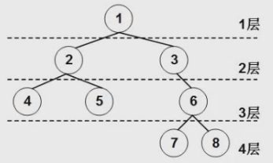

=== 树的一些基本概念

- 结点: 图中一共 **8** 个结点.
- 结点的度: 结点的直接子结点数. 1 总共有 2 和 3 两个子结点, 所以 1 的度是 2.
- 树的度: 所有结点中, 度最高的值就是树的度.
- 叶子结点: 没有子结点的结点 或者 度为 0 的结点. 图中的 4 5 7 8
- 分支结点: 除叶子结点外的其他结点 或者 度不为 0 的结点. 图中的 1 2 3 6
- 内部结点: 除了根结点和叶子结点的其他结点 或者 在分支结点的基础之上在去掉根结点. 图中的 2 3 6
- 父, 子, 兄弟结点: 都是相对而言的. 图中 1 是 2 3 的父结点, 4 5 是 2 的子结点, 7 8 是兄弟结点
- 层次(高度): 如图所示: 4 层. 若某结点在第 i 层, 则其子结点在第 i + 1 层

=== 二叉树(binary tree)

定义: 树中节点的**度不大于 2 **的**有序树**.

递归定义: 二叉树是一棵**空树**, 或者是一棵由 一个根节点 和 两棵互不相交的, 分别称作根的左子树和右子树组成的非空树且左子树和右子树又同样都是二叉树.

性质:

. 第 i 层上最多有 2 ^ (i - 1) 个结点(i ≥ 1)
. 层数(高度)为 k 最多有2 ^ k - 1个结点(k ≥ 1)
. 对于任何一棵非空的二叉树,如果叶子节点个数为n0, 度为2的节点个数为n2, 则有: n0 = n2 + 1

7.10
