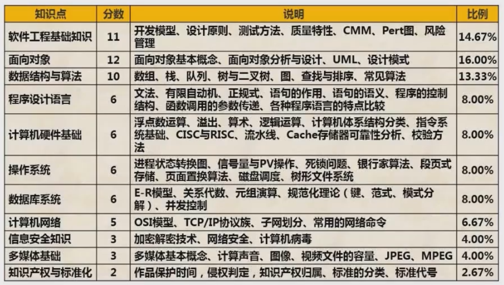

## 考试介绍

### 考试科目

#### 计算机与软件工程知识
- 时间: 上午
- 时长: 150分钟
- 形式: 笔试
- 题型: 75道选择题, 每个1分,
- 分值: 总分75分, 合格45分

#### 软件设计
- 时间: 下午
- 时长: 150分钟
- 形式: 笔试
- 题型: 主观题
  - 数据流图
  - 数据库
  - UML
  - 算法与数据结构(C语言)
  - 面向对象编程(C++或者Java)

### 分值分布

### 下午题

|知识点|考查内容|
|---|---|
|数据流图|补充数据流图的缺失部分(补充数据流,补充外部实体,补充数据存储), 数据流图的改错(包括修正数据流名称,数据流的起点与终点,删除多余数据流),与数据流图相关的概念简答题|
|数据库设计|E-R模型,关系模式,主键,外键,SQL语言|
|UML建模|用例图,类图与对象图,顺序图,活动图,状态图|
|C语言算法|链表,栈,二叉树,图基本操作的程序实现,动态规划法,分治法,回溯法,递归法,贪心法|
|Java程序设计|Java语法,设计模式|

