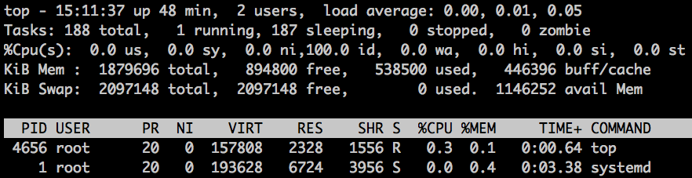

## 常用系统工作命令

### echo 命令

格式: 

```
echo [字符串|$变量]
```

用途: 用于在终端输出字符串或变量提取后的值

示例: 

```SHELL
# 打印字符 hello shell
echo "hello shell"
# 打印变量SHELL的值
echo $SHELL
```

### date 命令

格式: 

```
date [选项][+指定的格式]
```

用途: 显示和设置系统的时间或日期

示例: 

```SHELL
# 输出当前系统时间
date
# 格式化输出当前系统时间
date "+%Y-%m-%d %H:%M:%S"
# 设置当前系统时间
date -s 2008/08/08
date -s 08:08:08
date -s "08:08:08 2008-08-08"
date -s "08:08:08 20080808"
date -s "2008-08-08 08:08:08"
date -s "20080808 08:08:08"
# 查看今天是今年中的第几天
date "+%j"
```

延伸阅读: 

- [Linux中设置和同步时间](https://www.mtyun.com/library/all-about-time)
- [Linux时间同步的2种方法](http://blog.51yip.com/server/1474.html)

### reboot 命令

格式:

```
reboot
```

用途: 重启系统

延伸:

|命令|解释|
|---|---|
|reboot|重启系统|
|shutdown -r now|重启系统|
|shutdown -r +1|一分钟后重启系统|
|init 6|重启系统|


### poweroff 命令

格式:

```
poweroff
```

用途: 关闭系统, 并且关闭电源

延伸:

|命令|解释|
|---|---|
|poweroff|关闭系统, 并且关闭电源|
|shutdown -h now|立刻关机重启|
|shutdown -h +1|1分钟后关机|
|init 0|立即停止系统，需要人工关闭电源|
|halt|-|
|halt -p|-|

### logout 命令

格式:

```
logout
```

用途: 注销当前用户

延伸:

|命令|解释|
|---|---|
|logout|注销当前用户|
|exit|-|
|ctrl+d|-|


### wget 命令

格式

```
wget [参数] 下载地址
```

用途: 下载网络文件

常用的参数:

|参数|作用|
|---|---|
|-b|后台下载模式|
|-P|下载到指定目录|
|-t|最大尝试次数|
|-c|断点续传|
|-p|下载页面内所有资源, 包括图片, 视频等|
|-r|递归下载|

示例:

```SHELL
wget http://www.linuxprobe.com/docs/LinuxProbe.pdf
```

### ps 命令

格式

```
ps [参数]
```

用途: 查询系统中的进程状态

常用参数:

|参数|作用|
|---|---|
|-a|显示所有进程(包括其他用户的进程)|
|-u|用户以及其他详细信息|
|-x|显示没用控制终端的进程|

延伸阅读:

Linux系统中常见的5种进程状态

|标识符|状态|描述|
|---|---|---|
|R|运行|进程正在运行或者在运行队列中等待|
|S|中断|进程处于休眠中, 当某个条件形成后或者接受信号时, 则脱离该状态|
|D|不可中断|进程不响应系统异步信号, 即便用kill命令也不能将其中断|
|Z|僵死|进程已经终止，但描述符依然存在, 直到父进程调用wait4()系统函数后将进程释放|
|T|停止|进程收到停止信号后停止运行|


执行ps aux命令后的输出解释:

|-|-|
|---|---|
|USER|进程的所有者|
|PID|进程的ID号|
|%CPU|CPU占用率|
|%MEM|内存占用率|
|VSZ|虚拟内存使用量(单位为KB)|
|RSS|占用的固定内存量(单位为KB)|
|TTY|所在终端|
|STAT|进程状态|
|START|被启动的时间|
|TIME|实际使用的CPU时间|
|COMMAND|命令名称与参数|

### top 命令

格式

```
top
```

用途: 动态的查看系统的运行状态, 类似于Windows中的任务管理器

top 命令输出解释:



|-|-|-|-|-|-|-|-|
|---|---|---|---|---|---|---|---|
|top|系统时间|运行时间|登录终端数|系统一分钟内的负载平均值(越小则负载越低)|系统五分钟内的负载平均值(越小则负载越低)|系统十五分钟内的负载平均值(越小则负载越低)||
|tasks|进程总数|运行中的进程数|睡眠中的进程数|停止的进程数|僵死的进程数|||
|%CPU(s)|用户占用资源百分比|系统内核占用资源百分比|改变过优先级的进程资源百分比|空闲的资源百分比|等待IO的资源百分比|硬件中断|软件中断|
|KiB Mem|物理内存总量|内存使用量|内存空闲量|作为内核缓存的内存量||||
|KiB Swap|虚拟内存的总量|虚拟内存的使用量|虚拟内存的空闲量|已被提前加载的内存量||||

### pidof 命令

格式

```
pidof [参数] [服务名称]
```

用途: 查询某个指定服务进程的PID值

示例:

```SHELL
pidof sshd
```

### kill 命令

格式

```
kill [参数] [进程的PID]
```

用途: 终止某个指定PID的服务进程

### killall 命令

格式

```
killall [参数] [服务名称]
```

用途: 终止某个指定名称的服务所对应的全部进程
