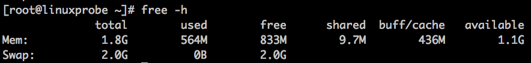

## 系统状态检测命令

### ifconfig 命令

格式

```
ifconfig [网络设备] [参数]
```

用途: 获取网卡配置与网络状态等信息

|-|-|
|---|---|
|inet|IPv4地址|
|inet6|IPv6地址|
|netmask|子网掩码|
|broadcast|广播地址|
|mtu|网卡的最大传输单元(bytes)|

延伸阅读

- [ifconfig命令](https://www.cnblogs.com/peida/archive/2013/02/27/2934525.html)

### uname 命令

格式

```
uname [-a]
```

用途: 查看系统内核与系统版本信息

```
Linux linuxprobe.com 3.10.0-514.el7.x86_64 #1 SMP Tue Nov 22 16:42:41 UTC 2016 x86_64 x86_64 x86_64 GNU/Linux
```

解释:

|-|-|-|
|---|---|---|
|Linux|uname -s|系统的内核名称|
|linuxprobe.com|uname -n|主机名|
|3.10.0-514.el7.x86_64|uname -r|内核发行号|
|#1 SMP Tue Nov 22 16:42:41 UTC 2016|uname -v|内核版本|
|x86_64|uname -m|硬件架构名称|
|x86_64|uname -p|处理器类型|
|x86_64|uname -i|硬件平台|
|GNU/Linux|uname -o|操作系统名称|


查看当前系统版本的详细信息

```SHELL
cat /etc/redhat-release
```

```
CentOS Linux release 7.3.1611 (Core)
```

### uptime 命令

格式

```
uptime
```

用途: 查看系统的负载信息(即是top命令的第一行)

### free 命令

格式

```
free [-h]
```

用途: 显示当前系统中内存的使用量信息



### who 命令

格式

```
who [参数]
```

用途: 查看当前登入主机的用户终端信息

### last 命令

格式

```
last [参数]
```

用途: 查询本机的登录记录

### history 命令

格式

```
history [-c]
```

用途: 显示历史执行过的命令, 使用-c参数可以清空命令的历史记录(~/.bash_history)

### sosreport 命令

格式:

```
sosreport
```

用途: 收集系统配置及架构信息并输出诊断文档
