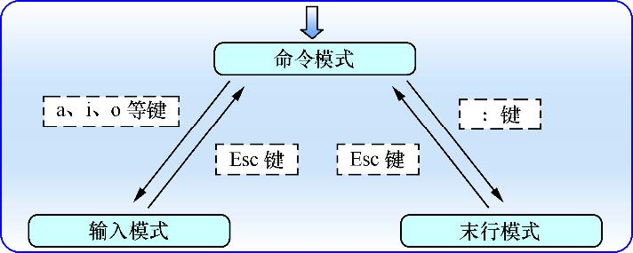

## Vim文本编辑器

默认先进入**命令模式**

- 命令模式: 控制光标移动, 可对文本进行复制, 粘贴, 删除, 查找等等
- 输入模式: 正常的文本录入
- 末行模式: 保存或退出文档, 以及设置编辑环境

Vim中**命令模式**下常用的命令

|命令|作用|
|---|---|
|dd|删除(剪切)光标所在行|
|5dd|删除(剪切)光标处开始的5行|
|yy|复制光标所在整行|
|5yy|复制光标处开始的5行|
|n|显示搜索命令定位到的下一个字符串|
|N|显示搜索命令定位到的上一个字符串|
|u|撤销上一步的操作|
|P|将之前删除(dd)或复制(yy)过的数据粘贴到光标后面|

Vim中**末行模式**下常用的命令

|命令|作用|
|---|---|
|:w|保存|
|:q|退出|
|:q!|强制退出(放弃修改)|
|:wq!|强制保存退出|
|:set nu|显示行号|
|:set nonu|不显示行号|
|:命令|执行该命令|
|:整数|跳转到该行|
|:s/one/two|将光标所在行的第一个one替换成two|
|:s/one/two/g|将光标所在行的所有one替换成two|
|:%s/one/two/g|将全文中所有one替换成two|
|?字符串|在文本中从下至上搜索该字符串|
|/字符串|在文本中从上至下搜索该字符串|

#### 编写简单文档
