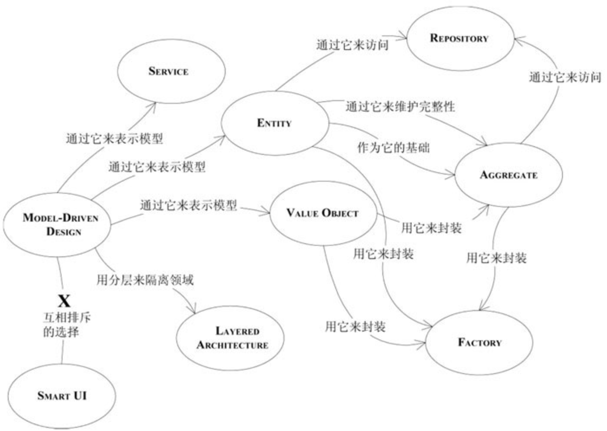

# notebook

面向对象开发流程:

需求模型 ➡ 领域模型 ➡ 设计模型 ➡ 实现模型

1. 需求模型: 通过和需求方沟通, 结合行业经验和知识, 明确客户的需求
2. 领域模型(OOA): **基于需求模型**, 提炼出领域相关的概念, 为设计模型做准备
3. 设计模型(OOD): **基于领域模型**, 结合面向对象的设计技巧, 完成类的设计
4. 实现模型: **基于设计模型**, 将设计模型翻译为具体的语言实现, 完成编码

香港节点
ss://YWVzLTI1Ni1jZmI6ZUlXMERuazY5NDU0ZTZuU3d1c3B2OURtUzIwMXRRMERAMjA5LjU4LjE4OC4xMjo4MDk3
