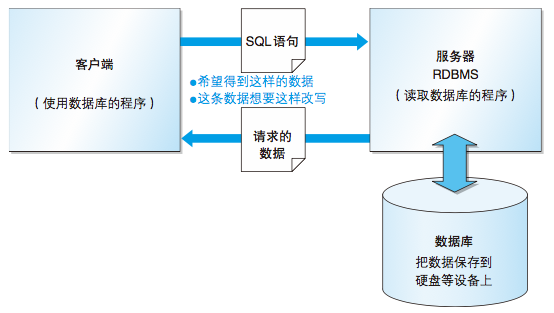

## 数据库是什么

- 数据库是将大量数据保存起来, 通过计算机加工而成的可进行**高效访问**的**数据集合**
- 用来管理数据库的计算机系统称为数据库管理系统(DBMS, Database Management System)
- 一般DBMS支持多用户同时操作
- 关系型数据库需要通过关系数据库管理系统(RDBMS, Relational Database Management System)进行管理, 例如: SqlServer, Oracle, MySQL, PostgreSQL
- 操作关系型数据库需要使用SQL语言

## DBMS的种类

- 层次数据库(HDB, Hierarchical Database), 数据以树状结构展示, 很少使用
- **关系数据库**(RDB, Relational Database), 类似Excel, 可以使用SQL(Structured Query Language)对数据进行操作
- 面向对象数据库(OODB, Object Oriented Database)
- XML数据库(XMLDB, Database)
- 键值存储系统(KVS, Key-Value Store)

## RDBMS的系统结构

1. 客户端(可能是多个)发送SQL语句到服务器, 服务器解析SQL后, 按照SQL语义操作数据库.
2. 数据库存储数据的方式类似于Excel, 每一个sheet(**表**)中有行有列, 每一列是同一种类型的数据(**字段**), 每一行是一条条的数据(**记录**)
3. 关系数据库必须**以行为单位**进行数据的读写
